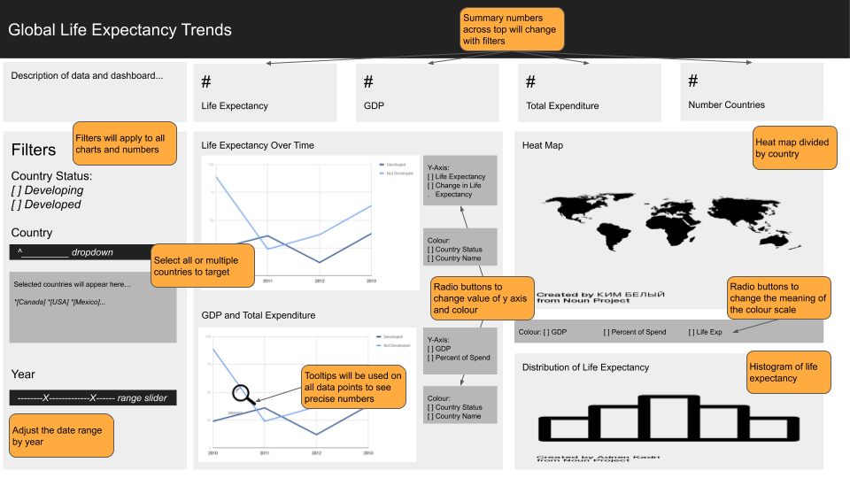
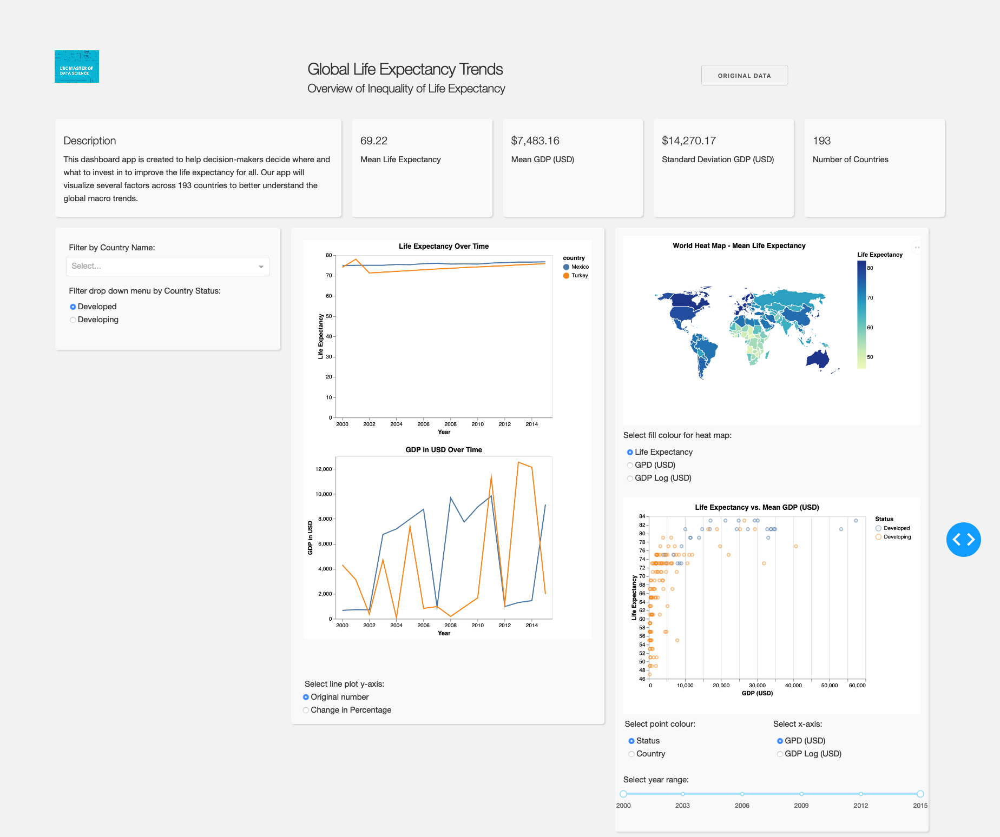

# Life Expectancy Dashboard

## Background

This repo was created as a submission for class DSCI 532 as part of the Masters of Data Science program at the University of British Columbia.

Team members (lab 1, group 101):

- Jake Lee
- Sam Edwardes
- Zoe Pan

## Milestone 1:

- [Project Proposal](docs/proposal.md)
- [Code of Conduct](docs/team-code-of-conduct.md)
- [App Description and Sketch](#app-description-and-sketch)

## Milestone 2:

- [Heroku deployment](https://dsci-532-group101-milestone2.herokuapp.com/)
- [Reflection](docs/reflection.md)
- [App functionality](#app-functionality)

## Milestone 3:

*Under development*

## Milestone 4:

*Under development*

## App Description and Sketch

The app contains one page that includes four summary statistics and four main plots. The summary statistics are about the average life expectancy, average GDP around the world, standard deviation of GDP of all countries and the count of the countries in total in our dataset. The left column are line plots that visualize `life expectancy`, `GDP` (gross domestic product) over time by country or `life expectancy` and `GDP` change in percentage year over year. The right column of plots includes a geographic heat map that can compare `life expectancy`, `GDP`, or `GDP log` and a scatter plot of `life expectancy` by `GDP` or `GDP log` for selected year range for all countries.

We include `GDP log` variable for the heat map and scatter plot, because of the right skewness of the GDP distribution of all countries. With `GDP log`, some patterns may become more obvious.

One of the most interesting features of this dashboard is the ability to change the variable each plot explores. By allowing the user to choose the variable of the y-axis and colour for time series plots, and the colour variable for the heat map, users are able to answer many potential questions with a limited number of plots and screen real estate.

The dashboard will also include interactive elements. Tooltips will be used on all data points to allow the user to see precise values. The summary numbers at the top of the dashboard will serve as a “grounding point” so the user can easily compare individual observations to in view averages. Users are also able to filter the entire dashboard based on `country status` (developing or not developing), `country`, and a range of `years`.

## App Functionality

The top level of the plot contains a logo and dashboard title. The data is retrieved from [Kaggle](https://www.kaggle.com/kumarajarshi/life-expectancy-who). For the convenience of the user we have provided a button the user can click on to view the original data source.

The next row of the dashboard provides a description of the data and high level summary statistics. These help the user understand how far each country is from the mean values. These values intentionally do not change with the filters so the user can always refer back to this baseline.

The final row contains three columns:

- The filters on the left enables the user to choose which countries they specifically wish to review
- The life expectancy line plots allows the user to compare the life expectancy and GDP over time by country. Below the line plots the user can change the y-axis from absolve values to year over year percent change.
- The right top graph is a heat map for these 193 countries. The user can dynamically change what the fill colour represents choosing between: life expectancy, GDP, or logged GDP. Below the heat map is the GDP by life expectancy scatter plot for all 193 countries. By using the radio buttons and slider under the plot the user can look for interesting patterns or relationships between GDP and life expectancy.

