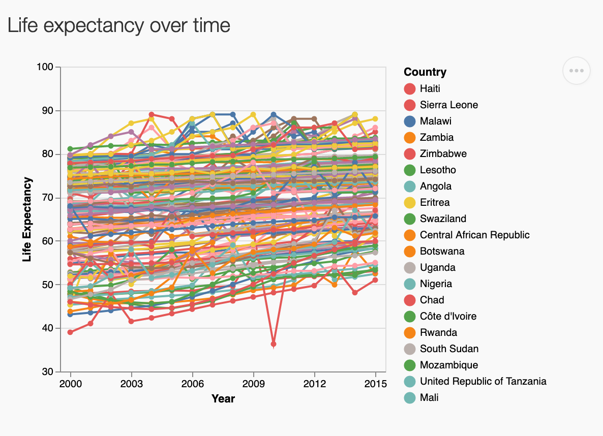

# Milestone 2 Reflection

### Background

Our team sought out to create a dashboard that could help explore the following research questions:

> 1. How has the life expectancy by country changed over time?
> 2. How are monetary factors associated with life expectancy?
> 3. Does the life expectancy between developing and developed countries differ?

We believe that in one week we were able to produce a useful dashboard that can help researchers answer the question above. Through the use of four interactive plots users are able to answer the research questions from a variety of angles.

To improve the dashboard we sought feedback from peers and TA. Below we have summarized what the app does well, what the current limitations are, and ideas for future improvements.

### What the app does well

- The design is clean and visually appealing. By organizing the plots by columns and the use of *pretty containers* each section clearly stands out and attracts the users eyes to the important sections.

### Current limitations

- The original proposed dashboard design was ambitious given the time constraints. We were not able to create all the features we had originally proposed:
  - No histogram for life expectancy was created
  - The line plots do have the functionality to change what the colour of the line represents
- There are over 193 countries. There is the possability for a user to select all 193 countries if they wish. This results in overplotting and reduces the usefullness of the plot.
  - 
- Upon reviewing the data in detail their appear to be some issues with data quality. Some of these issues were also noted on the [Kaggle page](https://www.kaggle.com/kumarajarshi/life-expectancy-who/data) where the data was obtained:
  - Canada and Greece are listed as a developing countries
  - There is no GDP data for the USA
  - `percentage expenditure` has some values which are greater than 100 (it is mean to represent the percent of GDP spent on health)

### Ideas for future improvement

 Add in additional geographic details:

- Map each country to a region or continent
- This could enable for comparisons by region/continent as oppposed to just country by country
  - It would also allow users to compare a countries performance relative to the continent/region means

Other items:

- Add in control to limit the number of countries that can be drawn on line plot
- Obtain better or more accurate GDP and life expectancy data